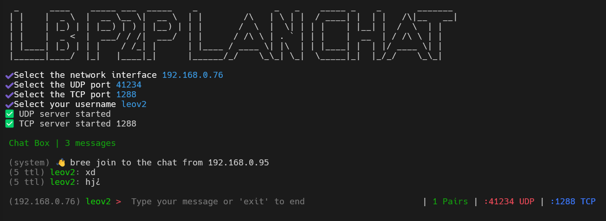
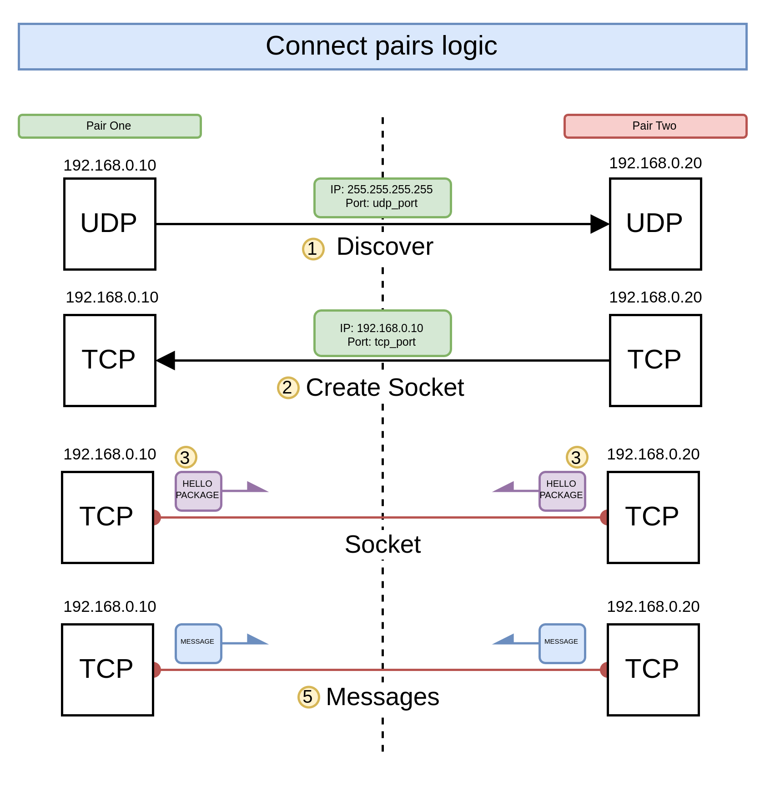
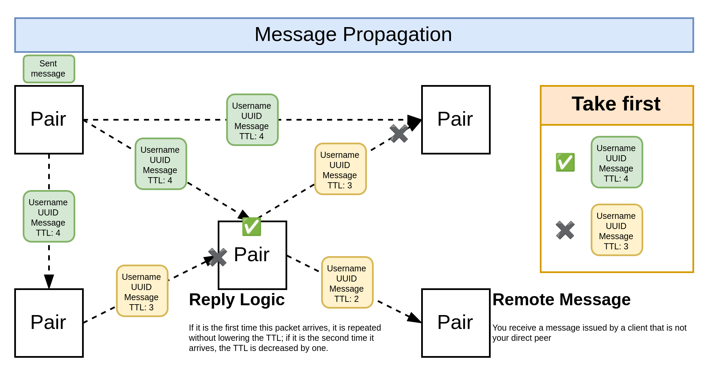

# LB P2P LAN CHAT

It's a simple P2P chat based on LAN networks. It maintains two listening sockets: a UDP socket for discovery and a TCP socket for message transport.



# Installation

## Build

```bash
$ npm install
```

```bash
$ npm run build
```

## Link

To register command and exec the chat with `$ lb-p2p-lan-chat`

```bash
$ npm link
$ lb-p2p-lan-chat
```

# How?




# Disclaimer

This project is made for educational purposes and to understand how P2P mesh networks work.
